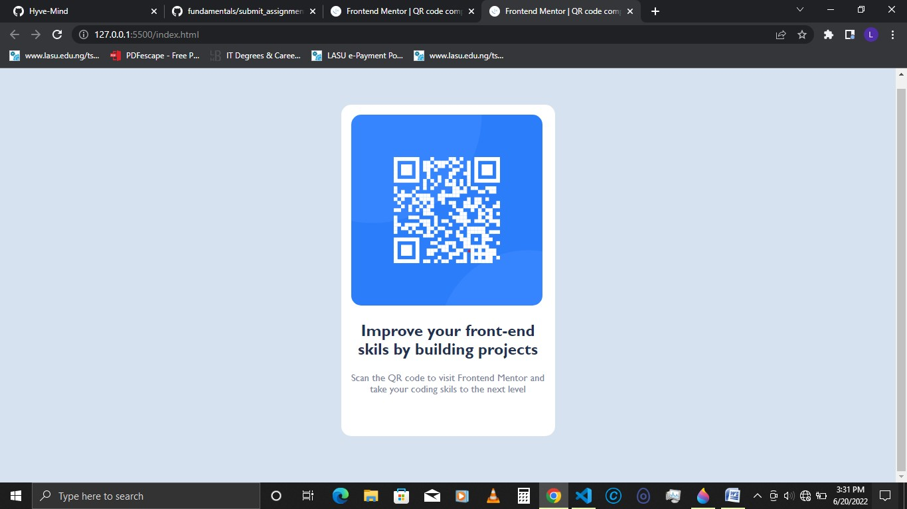

# Frontend Mentor - QR code component solution

This is a solution to the [QR code component challenge on Frontend Mentor](https://www.frontendmentor.io/challenges/qr-code-component-iux_sIO_H). Frontend Mentor challenges help you improve your coding skills by building realistic projects. 

## Table of contents

- [Overview](#overview)
  - [Screenshot](#screenshot)
  - [Links](#links)
- [My process](#my-process)
  - [Built with](#built-with)
  - [What I learned](#what-i-learned)
  - [Continued development](#continued-development)
  - [Useful resources](#useful-resources)
- [Author](#author)
- [Acknowledgments](#acknowledgments)

### Screenshot




### Links


## My Process

>> I added a link containing the style.css file.
>> Then i created a [div] with a class of           [container]. This  serves as the wrapper.
>>  I added the Qr-code image to the page.
>>  I added the header [h2] and the paragraph [p].
>>  I styled the [Html] page in the [style.css] file. 

### Built with

- HTML5  markup
- CSS custom properties
- Google Fonts
- Flexbox
- Paint 3D - for checking the actual size of the images in the [design] folder 

### What i learned 

You can also CSS Flexbox to style a single [div]
```html
<div class="container">
    

    <h2>Improve your front-end skils by building projects</h2>
    <p>Scan the QR code to visit Frontend Mentor and take your coding skils to the next level</p>
  </div>
```
```css
body {
    display: flex;
    flex-direction: column;
    justify-content: center;
    align-items: center;
    height: calc(100vh - 1px); 
}
```

## Author

- Website - [Add your name here](https://www.your-site.com)
- Frontend Mentor - [@yourusername](https://www.frontendmentor.io/profile/yourusername)
- Twitter - [@yourusername](https://www.twitter.com/yourusername)